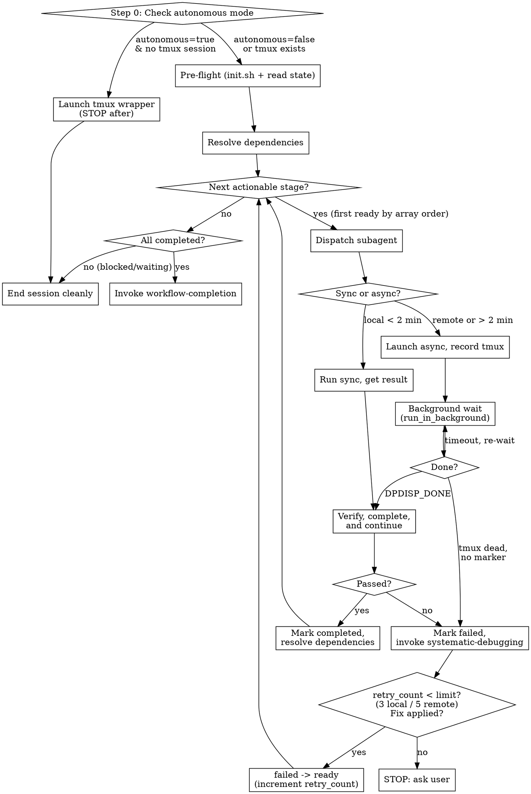

# Executing Workflows

## Overview

Execute workflow stages sequentially, one subagent per stage. The orchestrator (you) manages state, dispatches subagents, and advances the workflow.

**Core principle:** Fresh subagent per stage. File-centric state. Sequential execution. Persist every state change to disk immediately.

**REQUIRED BACKGROUND:** `superscientist:checkpoint-management` defines the state model (9 statuses, valid transitions), progress.log format, `running_process` schema, and poll protocol. This skill defines the orchestrator's execution loop.

**Persistence rule:** Every status transition must be written to `workflow-state.json` AND appended to `progress.log` *before* the next action. All progress.log entries MUST be appended via Bash tool using `echo "[$(date -Iseconds)] message" >> progress.log` — never generate timestamps as text.

## The Autonomous Execution Law

```
AFTER EACH STAGE, YOU MUST IMMEDIATELY EXECUTE THE CONTINUATION STEPS IN STEP 5.
THERE IS NO PAUSE POINT BETWEEN STAGES.
```

The user approved the workflow plan. That approval covers ALL stages. Do not ask for re-confirmation between stages. Do not report intermediate results in conversation. Do not summarize what just happened. Log to `progress.log` and continue.

**The ONLY reasons to pause and inform the user:**
1. Retry limit exceeded (3 local / 5 remote)
2. Workflow blocked (no ready/running stages, uncompleted stages remain)
3. Amendment needed (definitional field change requires user approval)
4. Budget exhausted — `session_cost + estimated_next_weight > session_budget`. This is the ONLY context-related exit condition. "The conversation feels long" is NOT a valid reason. Check the numbers.

**Violating the letter of this rule is violating the spirit of this rule.**

## Quick Reference

| Phase | Status transitions | Action |
|---|---|---|
| Dispatch (sync) | `ready` -> `preparing` -> `post_processing` -> `completed`/`failed` | Subagent runs inline, verify immediately |
| Dispatch (async) | `ready` -> `preparing` -> `running` -> `post_processing` -> `completed`/`failed` | tmux wrapper, background wait for DPDISP_DONE |
| Retry | `failed` -> `ready` (increment `retry_count`) | Max 3 retries (local) / 5 retries (remote), then stop |
| Dependency met | `pending` -> `ready` | Run after each stage completes |

| Decision | Sync | Async |
|---|---|---|
| When | Local backend AND < 2 min | Remote (always), or local > 2 min |
| Subagent returns | Inline results | tmux session name + submission.json path |
| Status after dispatch | Stays `preparing` (skip `running`) | `preparing` -> `running` |

**Template variables for subagent prompt:** `experiment_design` and `workflow_plan` are file paths from the top-level fields in `workflow-state.json`. Backend profile comes from `workflow-state.json` > `backend_profiles` > `{stage.backend or default_backend}`.

## Execution Loop



## Step 0: Check Autonomous Mode

This step is a gate, not part of the execution loop. It runs once before Pre-Flight.

1. Read `session_config.autonomous` from `workflow-state.json`.
2. If `false` → skip to Pre-Flight.
3. If `true`:

   **a. Check if wrapper is already running:**
   - Derive tmux session name: `workflow-runner-{workflow_id}` (from `workflow-state.json`).
   - Run: `tmux has-session -t "workflow-runner-{workflow_id}" 2>/dev/null`
   - If the tmux session exists → the wrapper launched this session. Skip Step 0 entirely, proceed to Pre-Flight. This prevents re-launching the wrapper on every session the wrapper creates.

   **b. Preflight checks:**
   - `command -v tmux` → if missing, FAIL: "tmux required for autonomous mode. Install it or set `autonomous: false` in `workflow-state.json`."
   - Verify `run-workflow.sh` exists at the superscientist plugin path (`superscientist/run-workflow.sh` relative to the plugin root, i.e., the parent of `skills/executing-workflows/`). If missing, FAIL: "`run-workflow.sh` not found. Autonomous session chaining not installed."

   **c. Permissions warning:**
   - Check if `.claude/settings.json` or `.claude/settings.local.json` exists with tool permissions configured.
   - If no settings file found, WARN (do not block): "No pre-approved permissions detected. Autonomous sessions may hang on permission prompts. Configure `.claude/settings.json` before proceeding."

   **d. Launch wrapper:**
   - Resolve `run-workflow.sh` path from the superscientist plugin directory.
   - Derive tmux session name: `workflow-runner-{workflow_id}`.
   ```bash
   tmux new-session -d -s "workflow-runner-${WORKFLOW_ID}" \
     "bash ${RUN_WORKFLOW_SH} '$(pwd)' 20"
   ```
   - Args: current working directory, max 20 sessions (default).

   **e. Log to `progress.log`:**
   ```bash
   echo "[$(date -Iseconds)] Autonomous mode activated. tmux session: workflow-runner-{workflow_id}" >> progress.log
   ```

   **f. Inform user:**
   ```
   Autonomous session chaining launched.

   Monitor:  tail -f progress.log
   Pause:    touch PAUSE
   Resume:   rm PAUSE
   Attach:   tmux attach -t workflow-runner-{workflow_id}
   Stop:     tmux kill-session -t workflow-runner-{workflow_id}
   ```
   (Substitute the actual tmux session name.)

   **g. STOP.** Do not execute stages in this session. The wrapper will launch the first `claude -p` session. Return control to the user.

## Pre-Flight

Before dispatching any stage:

1. **Run `init.sh`** — verifies environment. If it fails, invoke `superscientist:systematic-debugging`.
2. **Read `workflow-state.json`** — load full workflow state.
3. **Resolve dependencies** — advance `pending` stages to `ready` (see below).

## Dependency Resolution

Run after pre-flight AND after each stage completes:

```
for each stage with status "pending":
    if depends_on is empty:
        set status -> "ready" (no dependencies = immediately ready)
    else if ALL stages in depends_on have status "completed":
        set status -> "ready"
        echo "[$(date -Iseconds)] stage-N (Name): status -> ready (dependencies met)" >> progress.log
    else if ANY stage in depends_on has status "failed" or "skipped":
        echo "[$(date -Iseconds)] WARNING: stage-N blocked: dependency stage-M is failed/skipped" >> progress.log
```

Note: `skipped` is set only via user decision through the amendment protocol in `checkpoint-management`.

**"First" stage:** When multiple stages are `ready`, select the first by array order in `workflow-state.json`.

**→ After resolving dependencies, return to stage selection. Do not pause.**

## Per-Stage Execution

### 1. Select Stage

Find first stage with status `ready` (by array order in `workflow-state.json`). Failed stages become `ready` again through the Retry Flow below — they are not selected while still `failed`.

### 2. Dispatch Subagent

Update status: `ready` -> `preparing`. Log transition. Set `started_at`.

```
Agent(
  subagent_type: "general-purpose",
  description: "Execute stage-N: {stage name}",
  prompt: <see template below>,
  run_in_background: false
)
```

#### Subagent Prompt Template

```
You are executing stage-{id} ({name}) of workflow "{workflow_id}".

## Context
Read these for scientific goals and constraints:
- Experiment design: {experiment_design}
- Workflow plan: {workflow_plan}

## Stage Specification
{paste full stage JSON object from workflow-state.json}

## Dependency Outputs
{for each depends_on stage, list: "stage-{id} ({name}): {output_key}: {output_path}"}

## Backend
Profile: {profile_name}
Type: {local | remote}
{profile JSON with resource_defaults merged with any stage resource_overrides}

## Instructions
1. Verify ALL input files exist and are non-empty.
2. Prepare the computation script using stage parameters and domain skills.
3. **YOU MUST invoke `superscientist:compute-backend` to submit this job.**
   **NEVER run the computation command directly** (no `bash script`, no `python script.py`, no subprocess). DPDispatcher is the ONLY allowed execution path — even for local backends, even for "simple" one-liners, even when it feels like overkill.
   - Provide it: the stage directory, the command, forward/backward files.
4. Report back: submission status, submission.json path, and either
   inline results (sync) or tmux session name (async).

{IF retry_count > 0}
## Retry Context
This is retry #{retry_count}. Previous error: {last_error}
Fix applied: {description from progress.log}
Input scripts already corrected. DO NOT regenerate from scratch.
Verify the fix is present before running.
{END IF}
```

The compute-backend skill determines sync vs. async based on the backend type and estimated runtime.

### 3. Process Subagent Result

**Sync** (local, < 2 min): Subagent returns inline results. Status stays `preparing` — skip `running`. Proceed directly to step 5.

**Async** (remote, or local > 2 min): Subagent reports tmux session name and submission.json path. Update status: `preparing` -> `running`. Record `running_process` in `workflow-state.json` per the schema in `checkpoint-management`. Log:
```bash
echo "[$(date -Iseconds)] stage-N: status -> running (tmux: dpdisp_stage-N)" >> progress.log
```

**→ Continue to Step 4 (async) or Step 5 (sync). Do not report to the user.**

### 4. Monitor Background Process (async only)

**DO NOT poll manually in a loop.** Use a blocking background wait:

```bash
# run_in_background: true, timeout: 600000
while [ ! -f "stage-N/DPDISP_DONE" ]; do sleep 30; done; cat stage-N/DPDISP_EXIT_CODE
```

You will be auto-notified when the file appears. Do NOT sleep-and-check manually. Do NOT ask the user if the job is done.

**When you receive the completion notification:**

| Exit code | Action |
|---|---|
| `0` | Status → `post_processing`. Invoke `superscientist:result-verification`. Execute continuation in Step 5. |
| non-zero | Status → `failed`. Read `stage-N/err` (if exists) and `{workflow_root}/dpdispatcher.log`. Invoke `superscientist:systematic-debugging`. |

**If the background wait times out or is lost** (no notification after 10 minutes):

1. Run a single check: `test -f stage-N/DPDISP_DONE && cat stage-N/DPDISP_EXIT_CODE || echo "NOT_DONE"`
2. If done → process the result (same as notification path above).
3. If not done → the job is long-running. Log and end session cleanly:
   ```bash
   echo "[$(date -Iseconds)] stage-N: async job still running. Ending session for session-resume." >> progress.log
   ```
4. `session-resume` will pick up on next session start, check tmux state, and re-establish monitoring.

**Do NOT dispatch other stages while waiting.** Execution is sequential.

**→ After receiving notification, execute Step 5 immediately. Do not report to the user.**

### 5. Verify, Complete, and Continue

Set status → `post_processing`. Log and persist. Then invoke `superscientist:result-verification`.

- **Passed:** Status → `completed`. Set `completed_at`. Log.
- **Failed:** Status → `failed`. Set `last_error`. Log. Invoke `superscientist:systematic-debugging`.

Note: For sync flow, `post_processing` is set here (the only place). For async flow, it is set after the background wait detects `DPDISP_DONE` with exit 0.

**→ CONTINUATION (mandatory, no pauses):**

After marking `completed`:
1. **Budget accounting:**
   - Classify the completed stage: `sync` (local, no errors, one attempt), `async` (remote/HPC or background wait, no errors), `error_cycle` (any retry occurred), or `diagnostic` (Level 2 reproduction run). If multiple apply, use the highest weight.
   - Read `session_config` from `workflow-state.json`.
   - Increment `session_cost` by the stage's weight from `stage_weights`.
   - Write updated `session_cost` to `workflow-state.json`.
   - Log:
     ```bash
     echo "[$(date -Iseconds)] stage-N: session_cost += {weight} ({classification}), total={session_cost}/{session_budget}" >> progress.log
     ```

2. **Dependency resolution:** Advance `pending` → `ready` for stages whose dependencies are now met.

3. **Next action decision:**
   - All stages `completed` or `skipped`? → Set `exit_reason` to `"completed"`. Invoke `superscientist:workflow-completion`.
   - No `ready`/`running` but uncompleted stages remain? → Workflow is blocked. Log and inform user.
   - Any `ready` stages? → Estimate the next stage's weight (`sync` if local backend, `async` if remote). If `session_cost + estimated_next_weight > session_budget`:
     - Set `exit_reason` to `"budget_exhausted"` in `workflow-state.json`.
     - Log:
       ```bash
       echo "[$(date -Iseconds)] Session ending: budget exhausted (cost={session_cost}, budget={session_budget})" >> progress.log
       ```
     - **Stop execution.** Do not dispatch the next stage.
   - Otherwise → Return to Step 1 (Select Stage). Dispatch immediately.

After `systematic-debugging` applies a fix and transitions `failed` → `ready` (with `retry_count` incremented):
- Return to Step 1 (Select Stage). The retried stage is now `ready`.

After the background wait (Step 4) delivers a completion notification:
- Process the exit code per the table in Step 4. Then execute this same continuation block.

**There is no "report to user" step. The loop continues until a terminal condition is reached.**

### 6. HPC Failure Diagnostics

When a remote backend stage fails, apply the two-level diagnostic model before retrying:

**Level 1 (always free — no retry consumed):**

1. Read `{workflow_root}/dpdispatcher.log` — this file is written locally by DPDispatcher and is always available.
2. Pass relevant log entries to `systematic-debugging` in the prompt. Include: job IDs, status (`terminated` vs `finished`), `fail_count`, remote path.
3. If `systematic-debugging` can identify the root cause from `dpdispatcher.log` alone (e.g., `terminated` = wrong partition, OOM, duplicate `--gres`), proceed directly to fix and retry.

**Level 2 (costs one retry — use only when Level 1 is insufficient):**

1. Check if `stage-N/log` and `stage-N/err` exist locally. If they do, Level 2 is unnecessary — pass them to `systematic-debugging`.
2. If diagnostic files are missing (DPDispatcher aborted the `backward_files` download), dispatch a **diagnostic reproduction run**:
   - Include in the subagent prompt: "This is a diagnostic run. Use `submission.diagnostic.json` with `backward_files: ["log", "err"]` only. Preserve the original `submission.json`."
   - This IS a normal retry — it goes through the standard `failed` -> `ready` -> `preparing` -> `running` flow and increments `retry_count`.
   - After the diagnostic run completes, read the downloaded `log`/`err` and invoke `systematic-debugging`.
3. After `systematic-debugging` identifies the fix, dispatch the real fix retry with: "Reuse existing `submission.json` unless the fix requires parameter changes."

## Retry Flow

After `systematic-debugging` identifies and applies a fix:

1. **Transition:** `failed` -> `ready`. Increment `retry_count`. Log:
   ```bash
   echo "[$(date -Iseconds)] stage-N: retry #{count} after fix: {description}" >> progress.log
   ```
2. **Max retries:** Determine the retry limit from the backend:
   - Look up the stage's backend profile: `backend_profiles[stage.backend or default_backend]`
   - If `profile.type == "remote"`: max retries = **5**
   - If `profile.type == "local"`: max retries = **3**
   - If `retry_count` reaches the limit, **STOP**. Inform user: "stage-N has failed {limit} times. Manual intervention required."
3. **Old outputs:** Leave in place — the new run overwrites them.
4. **Parameter changes:** If the fix modifies `parameters` or `success_criteria` in `workflow-state.json`, use the amendment protocol from `checkpoint-management` first. Changes only to input script content (e.g., fixing a syntax error) do NOT require an amendment.
5. **Subagent context:** Include retry info in the prompt (see template). Prevents subagent from regenerating scripts and reverting the fix.
6. **Reuse vs regenerate:** Include the retry mode in the subagent prompt:
   - Script-level fix (e.g., corrected a flag in the input script) → add: "Reuse existing `submission.json`."
   - Submission-level fix (e.g., changed `gpu_per_node`, fixed `custom_flags`) → add: "Regenerate `submission.json` from updated parameters."

## Red Flags

| Thought | Reality |
|---------|---------|
| "I'll run all stages at once" | Sequential. One at a time. |
| "Skip verification, results look fine" | `result-verification` is mandatory for every stage. |
| "I'll update the state file later" | Update immediately on every transition. |
| "This will be quick, skip tmux" | Only skip tmux for local backend AND < 2 min. Remote always uses tmux. |
| "I'll keep polling, almost done" | If context is long, end session. `session-resume` picks up. |
| "I'll regenerate the input script for the retry" | Check if a fix was already applied. Use retry context in prompt. |
| "Dependencies are obvious, skip the check" | Run dependency resolution algorithmically. Never assume. |
| "init.sh passed last time, skip it" | Environment changes between sessions. Always run pre-flight. |
| "Let me try one more fix" (retry_count >= limit) | Stop. Repeated failures mean the approach may be wrong. Ask the user. Limit is 3 (local) or 5 (remote). |
| "It's local and fast, I'll just run the command directly" | **NEVER.** All jobs go through compute-backend → DPDispatcher. No exceptions. |
| "compute-backend is overkill for this simple script" | compute-backend is mandatory for every stage, regardless of complexity. |
| "I'll test the script first by running it directly, then use DPDispatcher" | **Never run the command directly.** Use `dargs check` and `--dry-run` to validate. |
| "The subagent already ran the job, I just need to check outputs" | If compute-backend was not invoked, the stage is not complete. The job must be re-run through DPDispatcher. |
| "I've completed this stage, let me update the user" | Update progress.log. The user reads logs, not conversation. Continue. |
| "Let me show the user this result" | Log to progress.log and dispatch the next stage. |
| "I should check if the user wants to proceed" | The user approved the workflow plan. That approval covers all stages. Continue. |
| "Stage N is done, let me summarize" | Summarize in progress.log, not in conversation. Dispatch the next stage. |
| "The user might want to review before continuing" | If verification passed, the stage is done. The user reviews the final report. |
| "I'll wait for the user to acknowledge" | Acknowledgment is not a step in the execution loop. Continue. |
| "The background job just finished, let me tell the user" | Process the result. Update state. Continue the loop. The notification is for you, not the user. |
| "I've been running for a while, maybe I should stop" | Check `session_cost` against `session_budget`. If under budget, continue. Your feelings about session length are not a valid exit condition. |
| "Autonomous mode is on, but I'll execute stages anyway" | Step 0 said STOP. The wrapper handles execution. Return control to the user. |
| "The tmux session exists, but I'll launch another one" | One wrapper per workflow. If `tmux has-session` succeeds, skip Step 0. |
| "I'll check autonomous mode later" | Step 0 runs BEFORE Pre-Flight. It's a gate, not a suggestion. |
| "The budget check is overhead, I'll skip it this time" | Budget accounting is mandatory after every stage. Skipping it defeats autonomous session chaining. |
