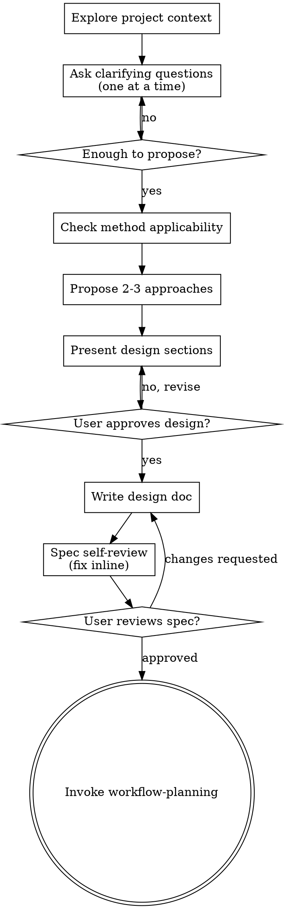

# Experiment Design

Help turn a computational science idea into a fully formed experiment design through natural collaborative dialogue.

Start by understanding the system and objective, then ask questions one at a time to refine the design. Once you understand what you're computing, present the design and get user approval.

<HARD-GATE>
Do NOT invoke any workflow skill, write any script, run any computation, or take any implementation action until you have presented a complete experiment design and the user has approved it. This applies to EVERY experiment regardless of perceived simplicity.
</HARD-GATE>

## Anti-Pattern: "This Experiment Is Straightforward"

Every experiment goes through this process. A single-point energy calculation, a quick equilibration, a "standard" MD run — all of them. "Straightforward" experiments are where unexamined assumptions cause the most wasted compute. The design can be short (a few paragraphs for truly simple experiments), but you MUST present it and get approval.

## Checklist

You MUST create a task for each of these items and complete them in order:

1. **Explore project context** — check existing files, input scripts, previous results, force fields
2. **Ask clarifying questions** — one at a time, understand system/objective/constraints/resources
3. **Check method applicability** — validate the proposed method for this specific system against literature
4. **Propose 2-3 approaches** — with trade-offs and your recommendation
5. **Present design** — in sections scaled to their complexity, get user approval after each section
6. **Write design doc** — save to `docs/superscientist/specs/YYYY-MM-DD-<topic>-design.md`
7. **Spec self-review** — scan for placeholders, missing convergence rationale, vague success criteria, unvalidated method choices (see below)
8. **User reviews written spec** — ask user to review the spec file before proceeding
9. **Transition to workflow** — invoke `superscientist:workflow-planning` to create execution plan

## Process Flow



**The terminal state is invoking workflow-planning.** Do NOT invoke executing-workflows or any other implementation skill. The ONLY skill you invoke after experiment-design is workflow-planning.

## The Process

**Understanding the system and objective:**

- Check existing files first (input scripts, structures, force fields, prior results)
- Ask questions one at a time to understand:
  - What system? (material, molecule, polymer — specific composition, structure, size)
  - What property? (Tg, diffusion, mechanical, phase behavior — and how measured)
  - Why? (reproduce known result, predict new property, validate method)
  - What compute backend? (local machine or HPC cluster)
    If HPC: queue/partition name, GPU or CPU (and count per node), number of nodes.
    Remind user they can specify scheduler-specific flags and per-stage resource overrides.
- Prefer multiple choice when possible: "Are you computing (a) bulk Tg from density vs. T, (b) dynamic Tg from MSD, or (c) both?"
- **Only one question per message** — if a topic needs more exploration, break it into multiple messages
- Do NOT present any design content until you have enough answers to propose approaches

**Checking method applicability:**

- Has this specific method + force field been validated for this specific system and property?
- Cite published references if available (authors, journal, year, key result)
- If the method is unvalidated for this system: propose a validation stage against published or experimental results before production
- Known limitations must be stated explicitly (e.g., "MD cooling rates are 10-12 orders of magnitude faster than experiment, systematically raising apparent Tg by 30-80 K")

**Exploring approaches:**

- Propose 2-3 different approaches with trade-offs
- Present options conversationally with your recommendation and reasoning
- Lead with your recommended option and explain why
- Approaches can differ in: method (AA vs CG), force field, ensemble, analysis technique, system size

**Presenting the design:**

- Once you believe you understand what you're computing, present the design
- Scale each section to its complexity: a few sentences if straightforward, up to 200-300 words if nuanced
- Ask after each section whether it looks right so far
- Cover these sections:

  **Method and Software** — which method, force field, software, and why

  **Computational Stages** — each stage with: purpose, inputs, key parameters with rationale, success criteria (specific and measurable), expected walltime, known pitfalls and safeguards

  **Convergence Strategy** — for every numerical parameter requiring convergence (cutoff, box size, timestep, cooling rate, number of samples): target value with rationale. "Standard practice" is acceptable rationale; "arbitrary" is not.

  **Expected Outputs** — final deliverables

  **Resource Estimate** — total walltime, storage, memory. Flag stages > 1 hour.

- Be ready to go back and clarify if something doesn't make sense

**Identifying pitfalls:**

For each computational stage, explicitly identify what commonly goes wrong and build safeguards into the design. Examples by method:

| Domain | Common Pitfalls |
|--------|----------------|
| MD polymer Tg | Insufficient equilibration, cooling rate too fast, box too small, Berendsen thermostat artifacts |
| DFT | SCF convergence for magnetic systems, DFT+U for transition metals, insufficient k-points, wrong pseudopotential |
| MC | Poor sampling of configuration space, move acceptance too low/high, finite-size effects |
| Free energy | Insufficient overlap between windows, hysteresis in TI, poor convergence of BAR/MBAR |

This is not exhaustive — identify pitfalls specific to the user's system.

**HPC software verification:**

For every HPC binary path, package requirement, or software flag specified in the design:
- Ask: "Has this been tested on the target cluster? Can you confirm `lmp -h` shows the GPU package?"
- If verified: note the verification in the design doc (e.g., "Confirmed via `lmp -h` on 2026-03-30")
- If not verified: annotate with `[UNVERIFIED]` in the design doc:
  ```
  **LAMMPS command:** `/gpfs/home/user/lammps/bin/lmp -sf gpu` [UNVERIFIED]
  ```

`[UNVERIFIED]` signals to `workflow-planning` and `compute-backend` that a `prepend_script` validation is mandatory for stages using this command.

## After the Design

**Documentation:**

- Write the validated design to `docs/superscientist/specs/YYYY-MM-DD-<topic>-design.md`
- Use the design doc template below

**Spec Self-Review:**
After writing the spec document, look at it with fresh eyes:

1. **Placeholder scan:** Any "TBD", "TODO", incomplete sections, or vague parameters? Fix them.
2. **Convergence rationale:** Does every numerical parameter have a stated rationale? "Standard practice" is fine. "Arbitrary" or missing is not.
3. **Method validation:** Is there a citation or validation stage for the method/force field choice?
4. **Success criteria check:** Is every success criterion specific and measurable? "Converged" is not acceptable — give numbers.
5. **Pitfall coverage:** Does every stage have identified pitfalls with safeguards?
6. **HPC verification:** Are all HPC binary paths and package requirements marked as verified or `[UNVERIFIED]`? No unexamined assumptions about remote software.
7. **Internal consistency:** Do stages connect properly? Are inputs/outputs consistent?

Fix any issues inline. No need to re-review — just fix and move on.

**User Review Gate:**
After the self-review passes, ask the user to review the written spec:

> "Spec written to `<path>`. Please review it and let me know if you want to make any changes before we move to workflow planning."

Wait for the user's response. If they request changes, make them and re-run the self-review. Only proceed once the user approves.

**Workflow Planning:**

- Invoke `superscientist:workflow-planning` to create the execution plan
- Do NOT invoke any other skill. workflow-planning is the next step.

## Design Doc Template

```markdown
# [Topic] Experiment Design

**Objective:** [What we're computing and why]
**System:** [Material/molecule, composition, structure, size]
**Method:** [DFT/MD/MC/etc. with specific functional/forcefield/ensemble]
**Software:** [VASP/LAMMPS/etc. with version if known]

## Method Validation
[Why this method is appropriate. Published references.
If unvalidated: include validation stage in workflow.]

## Computational Stages

### Stage N: [Name]
- **Purpose:** [What this stage computes]
- **Inputs:** [What it needs]
- **Parameters:** [Key parameters with rationale]
- **Success criteria:** [Specific, measurable]
- **Expected walltime:** [Rough estimate]
- **Known pitfalls:** [What to watch for + safeguards]

## Convergence Strategy
[Which parameters need convergence testing. Target accuracy. Rationale.]

## Expected Outputs
[Final deliverables.]

## Resource Estimate
[Total walltime, storage, memory.]
[If HPC: backend type, queue/partition name, GPU/CPU and count per node, number of nodes.
Scheduler-specific flags if any. Per-stage resource overrides if any.]
```

## Red Flags — STOP and Reconsider

| Thought | Reality |
|---------|---------|
| "This experiment is straightforward" | Straightforward experiments still need designs. Short design, but still a design. |
| "Standard parameters should work" | State which standard and why. |
| "Everyone uses this method" | For this specific system? Cite a reference. |
| "We'll figure out convergence later" | Define criteria now, before computing. |
| "Success criteria: converged" | Not specific enough. Numbers required. |
| "I'll present the full design first, then ask questions" | Ask questions FIRST. Design comes AFTER understanding. |
| "Let me just outline the whole approach while we wait" | No. Understand the system before proposing anything. |
| "The user probably wants X" | Ask. Don't assume. |

## Key Principles

- **One question at a time** — Don't overwhelm with multiple questions in one message
- **Multiple choice preferred** — Easier to answer when possible
- **No design before understanding** — Resist the urge to propose before you know the system
- **Every parameter needs rationale** — "Standard practice" is fine. "Arbitrary" is not.
- **Every stage needs pitfalls** — If you can't name one, you don't understand the stage well enough
- **Incremental validation** — Present design section by section, get approval as you go
- **Method validation is not optional** — Cite a reference or include a validation stage
