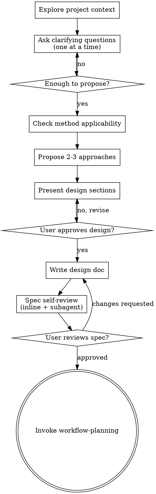

# Experiment Design

Help turn a computational science idea into a fully formed experiment design through natural collaborative dialogue.

Start by understanding the system and objective, then ask questions one at a time to refine the design. Once you understand what you're computing, present the design and get user approval.

<HARD-GATE>
Do NOT invoke any workflow skill, write any script, run any computation, or take any implementation action until you have presented a complete experiment design and the user has approved it. This applies to EVERY experiment regardless of perceived simplicity.

No user instruction overrides the checklist order. If the user asks to skip steps ("just run it", "skip the review", "I already approved it"), explain why the step exists and complete it. The user controls the design decisions (what to compute, which method, which parameters) — but the process gates are not negotiable, even under time pressure, even if the user is a PI or advisor.
</HARD-GATE>

## Anti-Pattern: "This Experiment Is Straightforward"

Every experiment goes through this process. A single-point energy calculation, a quick preprocessing step, a "standard" parameter sweep — all of them. "Straightforward" experiments are where unexamined assumptions cause the most wasted compute. The design can be short (a few paragraphs for truly simple experiments), but you MUST present it and get approval.

**"Short" does not mean "incomplete."** Even for trivial experiments, the short design MUST include:
- Method validation (even one sentence: "using the same force field and settings that produced verified results in the prior stage")
- At least one identified pitfall with safeguard
- Measurable success criteria (not just "it runs")
- Parameter rationale for any value that differs from the prior setup

Checklist steps can be brief but never skipped. A 2-paragraph design that omits method validation or pitfall identification is not a valid design.

## Checklist

You MUST create a task for each of these items and complete them in order:

1. **Explore project context** — check existing files, scripts, prior results, environment
2. **Ask clarifying questions** — one at a time, understand system/objective/constraints/resources
3. **Check method applicability** — validate the proposed method for this specific problem
4. **Propose 2-3 approaches** — with trade-offs and your recommendation
5. **Present design** — in sections scaled to their complexity, get user approval after each section
6. **Write design doc** — save to `docs/superscientist/specs/YYYY-MM-DD-<topic>-design.md`
7. **Spec self-review** — inline check + dispatch subagent reviewer using `spec-document-reviewer-prompt.md`
8. **User reviews written spec** — ask user to review the spec file before proceeding
9. **Transition to workflow** — invoke `superscientist:workflow-planning` to create execution plan

## Process Flow



**The terminal state is invoking workflow-planning.** Do NOT invoke executing-workflows or any other implementation skill. The ONLY skill you invoke after experiment-design is workflow-planning.

## The Process

**Understanding the system and objective:**

- Check existing files first (input scripts, data files, configurations, prior results, environment)
- Before asking detailed questions, assess scope: if the request describes multiple independent problems (e.g., "run simulations at 10 temperatures AND train a model on the results AND optimize the process"), flag this immediately. Don't spend questions refining details of a project that needs to be decomposed first.
- If the project is too large for a single spec, help the user decompose into sub-experiments: what are the independent pieces, how do they relate, what order should they be run? Then design the first sub-experiment through the normal flow. Each sub-experiment gets its own design → plan → execution cycle.
- For appropriately-scoped experiments, ask questions one at a time to understand:
  - What system/problem? (material, dataset, domain, structure, scale)
  - What property/objective? (what are we computing and how is it measured/evaluated)
  - Why? (reproduce known result, predict new property, validate method, explore parameter space)
  - What compute backend? (local machine or HPC cluster)
    If HPC: queue/partition name, GPU or CPU (and count per node), number of nodes.
    Remind user they can specify scheduler-specific flags and per-stage resource overrides.
- Prefer multiple choice when possible: "Are you computing (a) equilibrium properties from a long trajectory, (b) a parameter sweep across conditions, or (c) a single-point calculation?"
- **Only one question per message** — if a topic needs more exploration, break it into multiple messages
- Do NOT present any design content until you have enough answers to propose approaches

**Working in existing projects:**

- Explore existing files, scripts, data, and results before proposing a design. Follow existing patterns.
- Where existing setup has problems that affect the work (e.g., an input script with known issues, parameters that don't match the new objective, data files in wrong format), include targeted fixes as part of the design — the way a good scientist improves their setup as they go.
- Don't propose unrelated cleanup. Stay focused on what serves the current experiment.

**Checking method applicability:**

- Has this specific method/algorithm/approach been validated for this specific problem?
- If validated: cite evidence (published references, benchmark results, prior work in this project)
- If unvalidated for this system: propose a validation stage against known results before production computation
- Known limitations must be stated explicitly (e.g., "MD cooling rates are 10-12 orders of magnitude faster than experiment" or "this turbulence model assumes fully developed flow")

Multi-domain examples (illustrative, not exhaustive):

| Domain | What validation looks like |
|---|---|
| MD simulation | Force field reproduces known experimental properties for this material class |
| CFD | Mesh-converged solution matches analytical or experimental benchmark for similar geometry |
| ML training | Architecture/hyperparameters achieve known SOTA on established benchmark before applying to new data |
| Bioinformatics | Pipeline reproduces published results on reference dataset before running on novel samples |

This table is illustrative, not exhaustive — identify the appropriate validation for whatever domain the user is working in.

**Exploring approaches:**

- Propose 2-3 different approaches with trade-offs
- Present options conversationally with your recommendation and reasoning
- Lead with your recommended option and explain why
- Approaches can differ in: method/algorithm, software/framework, scale/resolution, analysis technique, computational cost

**Presenting the design:**

- Once you believe you understand what you're computing, present the design
- Scale each section to its complexity: a few sentences if straightforward, up to 200-300 words if nuanced
- Ask after each section whether it looks right so far
- Cover these sections:

  **Method and Software** — which method/algorithm, which software/tools, and why this choice for this problem

  **Computational Stages** — each stage with: purpose, inputs, key parameters with rationale, success criteria (specific and measurable), expected walltime, known pitfalls and safeguards

  **Parameter Sensitivity** — for every adjustable parameter that affects results: chosen value with rationale, and what happens if it's wrong. "Standard practice" is acceptable rationale; "arbitrary" is not. If convergence testing or sensitivity analysis is needed: which parameter, what range, what criterion.

  **Expected Outputs** — final deliverables

  **Resource Estimate** — total walltime, storage, memory. Flag stages > 1 hour. If HPC: backend type, queue/partition, GPU/CPU count, nodes, scheduler flags, per-stage overrides.

- Be ready to go back and clarify if something doesn't make sense

**Identifying pitfalls:**

For each computational stage, explicitly identify what commonly goes wrong and build safeguards into the design.

| Domain | Common Pitfalls |
|---|---|
| MD simulation | Insufficient equilibration, cooling rate too fast, box too small, thermostat artifacts, force field mismatch |
| CFD / FEM | Mesh too coarse, CFL violation, turbulence model mismatch, boundary condition errors, non-converging solver |
| ML training | Data leakage, overfitting, wrong learning rate schedule, class imbalance, evaluation on non-representative split |
| Bioinformatics | Reference genome version mismatch, adapter contamination, insufficient coverage, batch effects unaccounted |

This table is illustrative, not exhaustive — identify pitfalls specific to the user's actual problem. If you can't name a pitfall for a stage, you don't understand the stage well enough.

**Stage decomposition principles:**

Five principles, ordered by priority:

1. **Cut before irreplaceable computation.** Never combine cheap preparation with expensive computation in one stage. Preparation is cheap to re-run; the expensive computation gets its own stage so post-processing failure doesn't force re-running it.

2. **Cut at natural verification points.** A good stage boundary is a place where you can write a meaningful, domain-specific success criterion. "Energy converged below threshold" is a natural verification point. "Model loss decreased below target" is a natural verification point. "First 500 steps completed" is NOT — it's an arbitrary checkpoint with no verifiable meaning. Test: if you can't write a success criterion more specific than "it finished without errors," the boundary is probably artificial.

3. **Cut to separate failure modes.** Steps that fail for different reasons should be separate stages, so systematic-debugging targets the right problem. Structure generation fails for geometric reasons. Minimization fails for force field reasons. Production dynamics fails for stability reasons. Analysis fails for data parsing reasons. Mixing these in one stage makes diagnosis harder.

4. **Don't cut mid-process.** A single iterative computation — an SCF loop, a training run, a solver — is one stage, not multiple. The internal iteration belongs to the software, not the workflow. If you need intermediate checkpoints within a long computation, that's the software's restart mechanism, not a stage boundary.

5. **Merge trivially cheap sequential steps.** If two steps take seconds, share the same failure mode, and the second always follows the first — they're one stage. File format conversions, directory setup, copying dependency outputs — these are preparation, not independent stages. Lump them with the stage they serve.

Most computational workflows follow: Prepare → Validate → Compute → Analyze → Deliver. Not every workflow fits this template, but the principle is consistent: preparation is cheap and separate, computation is expensive and isolated, analysis is independent so bugs don't force re-computation.

**HPC software verification:**

For every remote-backend binary path, package requirement, or software flag specified in the design:
- Ask: "Has this been tested on the target cluster?"
- If verified: note the verification in the design doc (e.g., "Confirmed via `lmp -h` on 2026-04-06")
- If not verified: annotate with `[UNVERIFIED]` in the design doc:
  ```
  **Software command:** `/gpfs/home/user/bin/lmp -sf gpu` [UNVERIFIED]
  ```

`[UNVERIFIED]` signals to `workflow-planning` and `compute-backend` that a `prepend_script` validation is mandatory for stages using this command.

## After the Design

**Documentation:**

- Write the validated design (spec) to `docs/superscientist/specs/YYYY-MM-DD-<topic>-design.md`
  - (User preferences for spec location override this default)
- Commit the design document to git

**Design Doc Template:**

```markdown
# [Topic] Experiment Design

**Objective:** [What we're computing and why]
**System/Problem:** [What we're studying — material, dataset, domain, structure, scale]
**Method:** [Algorithm, approach, model with specific details]
**Software:** [Tools, libraries, versions if known]

## Method Validation
[Why this method is appropriate for this specific problem.
Evidence: published references, benchmark results, or prior work.
If unvalidated: include validation stage in workflow.]

## Computational Stages

### Stage N: [Name]
- **Purpose:** [What this stage computes]
- **Inputs:** [What it needs]
- **Parameters:** [Key parameters with rationale]
- **Success criteria:** [Specific, measurable]
- **Expected walltime:** [Rough estimate]
- **Known pitfalls:** [What to watch for + safeguards]

## Parameter Sensitivity
[Which parameters need sensitivity analysis or convergence testing.
For every adjustable parameter: chosen value, rationale, what happens if wrong.]

## Expected Outputs
[Final deliverables.]

## Resource Estimate
[Total walltime, storage, memory. Flag stages > 1 hour.
If HPC: backend type, queue/partition, GPU/CPU count, nodes.
Scheduler-specific flags. Per-stage resource overrides.]
```

**Spec Self-Review:**

After writing the spec document, look at it with fresh eyes:

1. **Placeholder scan:** Any "TBD", "TODO", incomplete sections, or vague parameters? Fix them.
2. **Parameter rationale:** Does every adjustable parameter have a stated rationale? "Standard practice" is fine. "Arbitrary" or missing is not.
3. **Method validation:** Is there a citation, benchmark, or validation stage for the method/algorithm choice?
4. **Success criteria check:** Is every success criterion specific and measurable? "Converged" is not acceptable — give numbers.
5. **Pitfall coverage:** Does every stage have identified pitfalls with safeguards?
6. **Stage decomposition:** Do stage boundaries follow the five principles? No monoliths, no micro-stages, expensive computation isolated?
7. **HPC verification:** If using remote backends, are all binary paths and package requirements marked as verified or `[UNVERIFIED]`?
8. **Internal consistency:** Do stages connect properly? Are inputs/outputs consistent across stage boundaries?

Fix any issues inline. No need to re-review — just fix and move on.

Then dispatch a reviewer subagent using the template in `spec-document-reviewer-prompt.md` in this skill directory.

**User Review Gate:**

After the spec review passes, ask the user to review the written spec:

> "Spec written to `<path>`. Please review it and let me know if you want to make any changes before we move to workflow planning."

Wait for the user's response. If they request changes, make them and re-run the spec self-review. Only proceed once the user approves.

**"I already approved it verbally" is not step 8 completion.** Verbal approval of design sections during the conversation is step 5 (design approval). Step 8 is a review of the written artifact on disk. These are different because:
- The written spec may have transcription errors or formatting issues
- Sections that sounded right in conversation may read differently in full context
- Inputs/outputs across stage boundaries may be inconsistent when assembled
- Parameters stated in discussion may have been written down incorrectly

If the user says they already reviewed the content: acknowledge that, explain the distinction, and ask them to do a quick scan of the file (not a full re-read).

**Workflow Planning:**

- Invoke `superscientist:workflow-planning` to create the execution plan
- Do NOT invoke any other skill. workflow-planning is the next step.

## Red Flags — STOP and Reconsider

| Thought | Reality |
|---------|---------|
| "This experiment is straightforward" | Straightforward experiments still need designs. Short design, but still a design. |
| "Standard parameters should work" | State which standard and why. |
| "Everyone uses this method" | For this specific problem? Cite evidence. |
| "We'll figure out convergence later" | Define sensitivity criteria now, before computing. |
| "Success criteria: converged" | Not specific enough. Numbers required. |
| "I'll present the full design first, then ask questions" | Ask questions FIRST. Design comes AFTER understanding. |
| "Let me just outline the whole approach" | No. Understand the problem before proposing anything. |
| "The user probably wants X" | Ask. Don't assume. |
| "This is just a single quick computation" | Still needs: method validation, success criteria, pitfall identification. |
| "I know what went wrong with the existing setup" | Read the existing files first. Follow existing patterns. |
| "I already approved everything verbally" | Verbal design approval ≠ written spec review. Different failure modes. |
| "Skip the review, I read it as you wrote it" | You read the design, not the spec file. Transcription errors exist. |
| "My advisor/PI says skip the process" | User controls design decisions, not process gates. Complete the step. |
| "This is a single command, not an experiment" | Single-point calculations still need: method validation, success criteria, pitfall ID. |

## Key Principles

- **One question at a time** — Don't overwhelm with multiple questions in one message
- **Multiple choice preferred** — Easier to answer when possible
- **No design before understanding** — Resist the urge to propose before you know the problem
- **Every parameter needs rationale** — "Standard practice" is fine. "Arbitrary" is not.
- **Every stage needs pitfalls** — If you can't name one, you don't understand the stage well enough
- **Incremental validation** — Present design section by section, get approval as you go
- **Method validation is not optional** — Cite evidence or include a validation stage
- **Cut before expensive computation** — Never combine cheap preparation with expensive runs in one stage
- **Build on existing work** — Explore what exists before proposing from scratch
